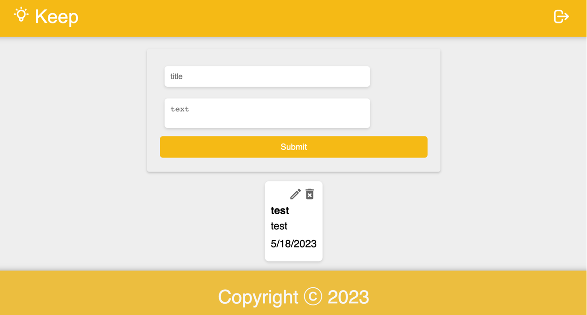

 

  

  

    Once you sign up, you can utilize this note app at any time! The app serves as a reminder, allowing you to effortlessly edit or delete your notes as frequently as desired.
     
     
    <a href="https://github.com/AtenaHatta/Keep"><strong>Explore the docs »</strong></a>
     
     
    <a href="https://github.com/AtenaHatta/Keep">View Demo</a>
    .
    <a href="https://github.com/AtenaHatta/Keep/issues">Report Bug</a>
    .
    <a href="https://github.com/AtenaHatta/Keep/issues">Request Feature</a>
  

    

## Table Of Contents

* [About the Project](#about-the-project)
* [Built With](#built-with)
* [Usage](#usage)
* [Roadmap](#roadmap)
* [Contributing](#contributing)
* [License](#license)
* [Authors](#authors)

## About The Project
Keep app is a digital tool that allows users to create, edit, organize, and store various types of notes. It provides a convenient and efficient way to capture and manage information.

<!-- (https://keep-five.vercel.app/) -->

## Built With
* React.js
* Redux

## Usage

Please sign up by providing a title for your note in the "Title" field and the content of your note in the "Text" field. Afterward, click on the "Submit" button. Once you submit, a new note will be displayed. You can edit or delete the note as needed. Please note that only you can access and view this note; it is not visible to anyone else.

## Roadmap

See the [open issues](https://github.com/AtenaHatta/Keep/issues) for a list of proposed features (and known issues).

## Contributing

Contributions are what make the open source community such an amazing place to be learn, inspire, and create. Any contributions you make are **greatly appreciated**.
* If you have suggestions for adding or removing projects, feel free to [open an issue](https://github.com/AtenaHatta/Keep/issues/new) to discuss it, or directly create a pull request after you edit the *README.md* file with necessary changes.
* Please make sure you check your spelling and grammar.
* Create individual PR for each suggestion.
* Please also read through the [Code Of Conduct](https://github.com/AtenaHatta/Keep/blob/main/CODE_OF_CONDUCT.md) before posting your first idea as well.

### Creating A Pull Request

1. Fork the Project
2. Create your Feature Branch (`git checkout -b feature/AmazingFeature`)
3. Commit your Changes (`git commit -m 'Add some AmazingFeature'`)
4. Push to the Branch (`git push origin feature/AmazingFeature`)
5. Open a Pull Request

## License

Distributed under the MIT License. See [LICENSE](https://github.com/AtenaHatta/Keep/blob/main/LICENSE.md) for more information.

## Authors

* **Atena Hatta** - ** - [Atena Hatta](https://github.com/AtenaHatta) - **

